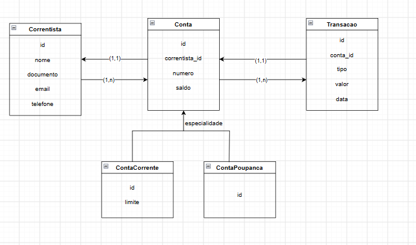

# Conta Bancária — API REST

RESTful para gerenciamento de contas bancárias de uma cooperativa de crédito. O sistema permite cadastrar correntistas, abrir contas corrente e poupança, realizar depósitos e saques respeitando as regras de cada tipo de conta, e consultar o extrato das transações realizadas.

## Tecnologias

- Java 8
- Spring Boot 2.7.18
- Spring Data JPA / Hibernate
- Banco de dados H2 (em memória)
- Maven
- Swagger / OpenAPI (springdoc)

## Como rodar o projeto localmente

### Pré-requisitos

- JDK 8 instalado
- Maven (ou usar o Maven Wrapper incluído no projeto, `mvnw`)

### Passos

1. Clone o repositório:
```
   git clone https://github.com/SEU-USUARIO/conta-bancaria.git
   cd conta-bancaria
```

2. Rode a aplicação:
```
   ./mvnw spring-boot:run
```
No Windows: `mvnw.cmd spring-boot:run`

Ou, se tiver o Maven instalado: `mvn spring-boot:run`

Também é possível abrir o projeto em uma IDE (como o IntelliJ), importar como projeto Maven e rodar a classe `ContaBancariaApplication`.

3. A aplicação sobe em `http://localhost:8080`.

4. O banco H2 é em memória, e as tabelas são criadas automaticamente ao subir a aplicação. Os dados são perdidos quando a aplicação é reiniciada.

### Console do banco H2

Para visualizar as tabelas e os dados:

- Acesse: `http://localhost:8080/h2-console`
- JDBC URL: `jdbc:h2:mem:contadb`
- User Name: `sa`
- Password: (deixe em branco)

### Documentação interativa (Swagger)

Com a aplicação rodando, acesse:

```
http://localhost:8080/swagger-ui.html
```

Lá é possível ver e testar todos os endpoints diretamente pelo navegador, sem precisar de Postman ou Insomnia.

## Modelagem de dados



## Script SQL de criação do banco

Não há um arquivo `schema.sql` no projeto. As tabelas são geradas automaticamente pelo Hibernate ao iniciar a aplicação (configuração `spring.jpa.hibernate.ddl-auto=update`, no `application.properties`), com base nas entidades JPA (`@Entity`). O script SQL equivalente ao que o Hibernate gera é:

```sql
create table correntista (
    id bigint generated by default as identity,
    nome varchar(255) not null,
    documento varchar(255) not null unique,
    email varchar(255),
    telefone varchar(255),
    primary key (id)
);

create table conta (
    id bigint generated by default as identity,
    numero varchar(255),
    saldo numeric(19,2),
    correntista_id bigint,
    primary key (id),
    foreign key (correntista_id) references correntista
);

create table conta_corrente (
    id bigint not null,
    limite numeric(19,2),
    primary key (id),
    foreign key (id) references conta
);

create table conta_poupanca (
    id bigint not null,
    primary key (id),
    foreign key (id) references conta
);

create table transacao (
    id bigint generated by default as identity,
    tipo varchar(255),
    valor numeric(19,2),
    data timestamp,
    conta_id bigint,
    primary key (id),
    foreign key (conta_id) references conta
);
```

## Endpoints disponíveis

### Correntistas

**Cadastrar correntista**
```
POST /correntistas
```
Requisição:
```json
{
  "nome": "Maria Silva",
  "documento": "123.456.789-00",
  "email": "maria@email.com",
  "telefone": "83999999999"
}
```
Resposta (201 Created):
```json
{
  "id": 1,
  "nome": "Maria Silva",
  "documento": "123.456.789-00",
  "email": "maria@email.com",
  "telefone": "83999999999"
}
```

**Consultar correntista**
```
GET /correntistas/{id}
```
Resposta (200 OK): os dados do correntista, ou 404 Not Found se o id não existir.

### Contas

**Abrir conta corrente**
```
POST /contas/corrente/{correntistaId}
```
Requisição:
```json
{
  "numero": "0001",
  "limite": 500.00
}
```
Resposta (201 Created): a conta criada, com saldo iniciando em 0. Retorna 404 se o correntista não existir.

**Abrir conta poupança**
```
POST /contas/poupanca/{correntistaId}
```
Requisição:
```json
{
  "numero": "0002"
}
```
Resposta (201 Created): a conta criada, com saldo iniciando em 0.

**Consultar conta**
```
GET /contas/{id}
```
Resposta (200 OK): os dados da conta (corrente ou poupança), ou 404 Not Found se não existir.

### Depósito e saque

**Depositar**
```
POST /contas/{id}/depositos
```
Requisição:
```json
{
  "valor": 100.00
}
```
Resposta (201 Created): a transação registrada.

**Sacar**
```
POST /contas/{id}/saques
```
Requisição:
```json
{
  "valor": 50.00
}
```
Resposta (201 Created): a transação registrada.

Regras de saque:
- Conta corrente: pode sacar até o saldo + limite.
- Conta poupança: pode sacar até o saldo.
- Se o valor solicitado ultrapassar o permitido, retorna 422 Unprocessable Entity.

### Extrato

**Listar transações de uma conta**
```
GET /contas/{id}/extrato
```
Resposta (200 OK):
```json
[
  {
    "id": 1,
    "tipo": "DEPOSITO",
    "valor": 100.00,
    "data": "2026-09-22T16:36:51.868"
  },
  {
    "id": 2,
    "tipo": "SAQUE",
    "valor": 50.00,
    "data": "2026-09-22T16:36:54.448"
  }
]
```
Retorna 404 Not Found se a conta não existir.

## O que foi feito

- Cadastro e consulta de correntistas.
- Abertura e consulta de contas corrente e poupança, com herança entre `Conta`, `ContaCorrente` e `ContaPoupanca`.
- Depósito e saque, com as regras de limite (conta corrente) e saldo (conta poupança).
- Registro de cada depósito e saque como uma `Transacao`.
- Extrato (listagem de transações) de uma conta, com um DTO de resposta (`TransacaoResponse`) para evitar repetição de dados da conta e do correntista em cada item.
- Tratamento de erros: 404 quando um correntista ou conta não é encontrado, e 422 quando o saldo é insuficiente para o saque (diferencial do desafio).
- Documentação interativa da API com Swagger/OpenAPI, acessível em `/swagger-ui.html` (diferencial do desafio).
- Uso de `BigDecimal` para valores monetários, evitando os problemas de arredondamento do `double`.

## O que ficou de fora e por quê

- **Rendimento da poupança e juros da conta corrente** (diferenciais opcionais): não implementados por priorizar o escopo obrigatório dentro do prazo. A implementação seguiria o mesmo padrão do depósito e saque: um endpoint que recebe a taxa como parâmetro, calcula o valor sobre o saldo, atualiza o saldo e registra uma nova `Transacao`.
- **Testes unitários**: não implementados por priorização de tempo. Seriam escritos com JUnit e Mockito, cobrindo principalmente as regras de saque (saldo suficiente/insuficiente em cada tipo de conta) e o cálculo de depósito.
- **DTOs de requisição/resposta nos demais endpoints**: implementei um DTO de resposta apenas para o extrato (`TransacaoResponse`), que era onde havia repetição real de dados (a `Conta` e o `Correntista` inteiros dentro de cada transação). Os demais endpoints (cadastro, abertura de conta, depósito, saque) continuam recebendo e retornando as entidades JPA diretamente, por simplicidade, já que não apresentam o mesmo problema.
- **Validação de valores**: não há validação explícita contra valores negativos ou zero em depósitos e saques.
- **Número de conta único**: o campo `numero` da conta não possui restrição de unicidade no banco.

## Decisões de design

- Utilizei herança JPA com estratégia `JOINED` para `Conta`, `ContaCorrente` e `ContaPoupanca`: os dados comuns ficam na tabela `conta`, e os específicos de cada tipo (como o `limite` da conta corrente) ficam em tabelas próprias, evitando colunas nulas.
- As regras de saque estão na própria entidade (`Conta.sacar()`, sobrescrito em `ContaCorrente`), usando polimorfismo em vez de verificações de tipo (`if`/`instanceof`) no service.
- Criei um endpoint de abertura de conta para cada tipo (`/contas/corrente/{id}` e `/contas/poupanca/{id}`), já que `Conta` é abstrata e cada tipo tem campos próprios de entrada.
- Usei H2 em memória em vez de MySQL para facilitar a execução do projeto por quem for avaliar, já que não exige instalação e configuração prévia de um banco externo. A troca para MySQL exigiria apenas alterar a dependência no `pom.xml` e a configuração de conexão no `application.properties`, sem alterar o código de acesso a dados (JPA/Hibernate).

## Vídeo de demonstração

[Video de demostração da API ](https://youtu.be/Jsbawj87HR4)